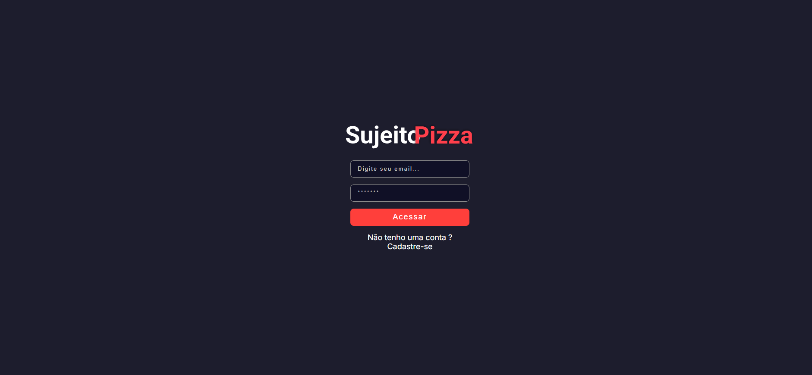
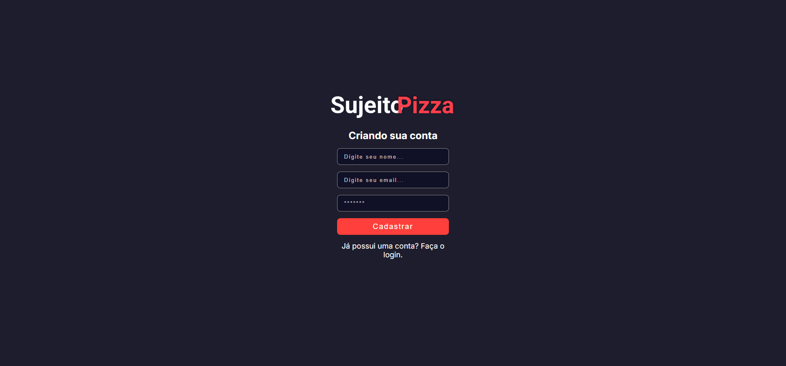

### Pizzaria web

#### Pages



#### Criando projeto
npx create-next-app@latest

*link ultimo visto
```
https://www.udemy.com/course/dev-fullstack/learn/lecture/45208793#overview
```

#### Dependências
npm install sass
npm install axios

* doc 
https://www.npmjs.com/package/cookies-next
npm install cookies-next

#### Rodando o projeto
npm run dev
